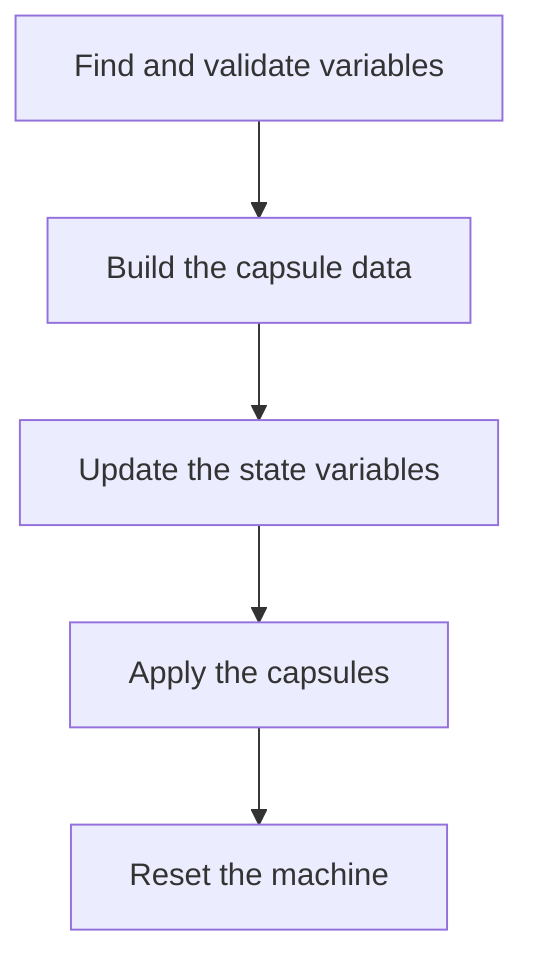

# Security Policy

Due to the nature of what we are doing, fwupd takes security very seriously.
If you have any concerns please let us know.

## Considerations For Secure Boot

In most secure boot configurations `fwup*.efi` will be signed and run by a first-stage bootloader
(e.g. Shim) and it is thus critically important that fwup-efi is not allowed to run unauthenticated
or untrusted code.

The following sections contain considerations about what the EFI binary actually does, which
hopefully should give enough assurance that using `fwupd.efi` is thus no threat to the chain of
trust required by secure boot.

### General Logic Flow

* Find and validate update state variables:

  * Read the list of EFI variables, and match the ones with the fwupd GUID (`0abba7dc-e516-4167-bbf5-4d9d1c739416`).
  * For each matching variable, parse this data as a
  [`FWUP_UPDATE_INFO`](https://raw.githubusercontent.com/fwupd/fwupd-efi/refs/heads/main/efi/fwup-efi.h)
  structure, being mindful the
    variable is big enough to copy, and that the device path is valid.
  * On any error abort, returning to the EFI firmware.

* Build our data structure and add the capsules to it:

  * Read the capsule file from the ESP, loading it into a dynamically allocated buffer.
  * If the capsule is a UX capsule (containing the pre-generated localised bitmap image of
    “Installing firmware update…”) then additionally verify the checksum is valid.
  * On any error abort, returning to the EFI firmware.

* Update the state variables:

  * Set the `FWUP_UPDATE_INFO.status` field to `ATTEMPTED` and overwrite each variable found in step 1.
  * On any error abort, returning to the EFI firmware.

* Apply the capsules:

  * Query the runtime machine capsule capabilities to get the reset kind, otherwise assume `EfiResetWarm`
  * Call the runtime “UpdateCapsule” interface with the capsule data as found in step 2.
  * On any error abort, returning to the EFI firmware.

* Reset the machine, unless step 4 did this for us automatically.

  * On any error abort, returning to the EFI firmware.

### Unauthenticated Code

There is no additional code launched directly from `fwupd.efi`.

### User Input

There is no user input processed during the execution of `fwupd.efi`.

### Programmatic Input

There are two inputs that are loaded:

* EFI variables with the update state, GUID and paths to the payload in the ESP – and then
  overwritten with modified contents.
* The firmware capsules from the ESP, loaded read only into memory and not verified directly.

The most important takeaway from this is that `fwupd.efi` does not *execute* the capsule itself,
but instead calls the firmware capsule loader runtime interface which tells the firmware to copy
the structured data into some part of the protected memory that will survive a reboot.
It then reboots the machine, causing the machine to re-initialize the firmware, which in turn
verifies the signature of the capsule payload and flashes the contents to NVRAM.
The machine then reboots again, re-initializing the firmware and booting to the OS.

For all vendors correctly implementing UEFI capsule updates, it is not possible to flash unsigned
capsules, or capsules signed by the wrong platform key.
The platform key is per-vendor and sometimes even specific to the machine type. Writing to efivarfs
requires root access, and the worst case scenario for a malicious user without the platform
certificate would be that they could schedule a capsule and cause the machine to quickly reboot
twice when the user next manually restarted – but no firmware update would happen.

## Supported Versions

The `1.3.x`, `1.2.x` and `1.1.x` branches are fully supported by the upstream authors.
Additionally, the `1.0.x` branch is supported for security and bug fixes.

Older releases than this are unsupported by upstream but may be supported by
your distributor or distribution. If you open an issue with one of these older
releases the very first question from us is going to be asking if it's fixed on
a supported branch. You can use the flatpak or snap packages if your distributor
is unwilling to update to a supported version.

| Version | Supported          |
| ------- | ------------------ |
| 1.3.x   | :heavy_check_mark: |
| 1.2.x   | :heavy_check_mark: |
| 1.1.x   | :heavy_check_mark: |
| 1.0.x   | :white_check_mark: |
| 0.9.x   | :x:                |
| 0.8.x   | :x:                |

## Reporting a Vulnerability

If you find a vulnerability in fwupd your first thing you should do is email
all the maintainers, which are currently listed in the `MAINTAINERS` file in
this repository.

Failing that, please report the issue against the `fwupd` component in Red Hat
bugzilla, with the security checkbox set. You should get a response within 3
days. We have no bug bounty program, but we're happy to credit you in updates
if this is what you would like us to do.
